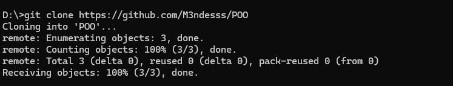

# Atividade Prática: Domínio de Git e GitHub

Este documento comprova a realização da atividade prática de Programação Orientada a Objetos (POO), demonstrando os conceitos de criação, clonagem, edição e gerenciamento de ramificações (branches) no Git.

---

## 1. Criação e Clonagem do Repositório

O repositório público chamado **`POO`** foi criado com sucesso no meu namespace. Em seguida, utilizei o terminal para clonar o repositório para a minha máquina local.

**Comando utilizado para clonagem:**

git clone https://github.com/M3ndesss/POO
